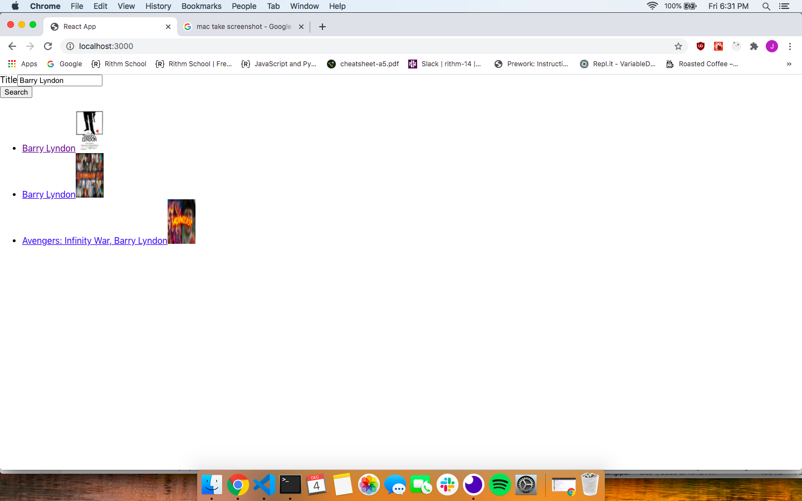
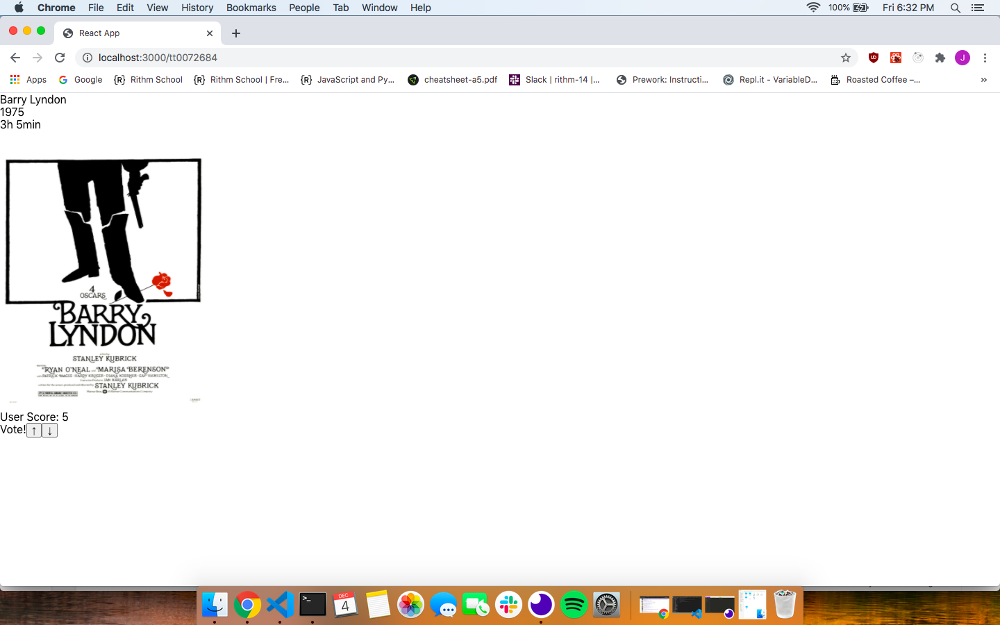

## Movie API Frontend

The backend folder also contains a README.md detailing how to set up and run the backend.

While you are in this folder:

1.  Install Requirements: `npm install`
2.  Start Front End server at localhost 3000: `npm start`
3. Create a .env file with the line REACT_APP_API_KEY={valid rapidAPI Key}

Images:

